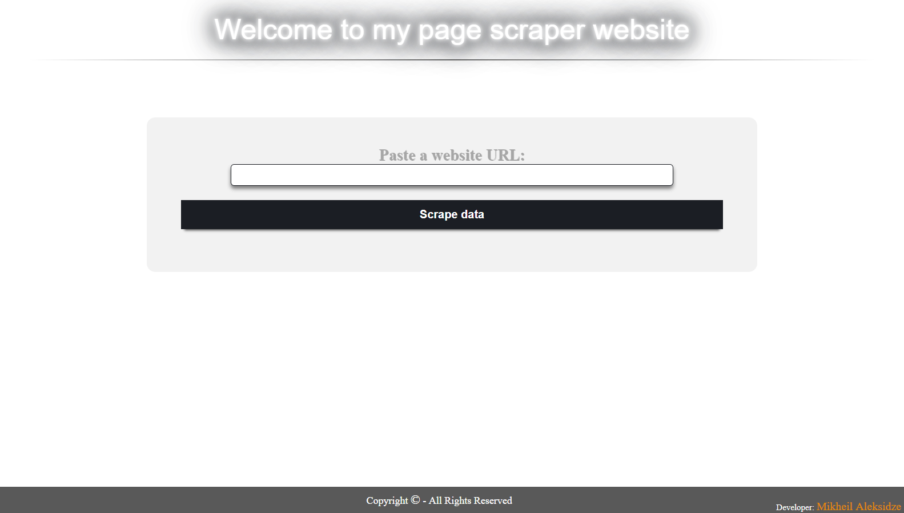

# PageScraper

>Extracts images and links from a web page

## Project description
This small PHP program scrapes all images and links from a web page.

<!--"Fina LLC" test task (Date: 29-Oct-2017).-->
